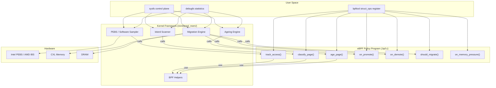

# Tiered Memory eBPF Framework — Complete API Design

## Architecture Overview



---

## 1. Struct Ops Hooks (eBPF Policy Callbacks)

### Currently Implemented ✅

| Hook | Signature | Called By | Purpose |
|------|-----------|-----------|---------|
| `init` | `int (*init)(struct tiered_mem_ops *ops)` | Framework on registration | One-time policy setup (allocate counters) |
| `track_access` | `void (*track_access)(ctx *)` | PEBS overflow + software sampler | Record that a page was accessed |
| `age_page` | `void (*age_page)(unsigned long pfn)` | Ageing workqueue | Decay access counts over time |
| `classify_page` | `int (*classify_page)(ctx *)` | ktierd scanner | Decide: 0=keep, 1=promote, 2=demote |

### Proposed New Hooks 🆕

| Hook | Signature | Called By | Purpose |
|------|-----------|-----------|---------|
| `should_migrate` | `int (*should_migrate)(ctx *)` | Migration engine pre-check | Fine-grained per-page migration veto (return 0=skip, 1=allow) |
| `on_promote` | `void (*on_promote)(ctx *)` | After successful promotion | Post-migration notification (reset counters, update stats) |
| `on_demote` | `void (*on_demote)(ctx *)` | After successful demotion | Post-migration notification |
| `on_migrate_fail` | `void (*on_migrate_fail)(ctx *, int err)` | After failed migration | Error handling, retry logic |
| `on_memory_pressure` | `int (*on_memory_pressure)(int nid, u64 free, u64 total)` | When watermarks hit | Emergency policy decisions (aggressive demotion) |
| `select_target_node` | `int (*select_target_node)(int src_nid, int is_promotion)` | Migration target selection | Custom NUMA placement logic |
| `on_scan_complete` | `void (*on_scan_complete)(u64 scanned, u64 hot, u64 cold)` | End of ktierd iteration | Per-iteration statistics callback |

### Updated `struct tiered_mem_ops`

```c
struct tiered_mem_ops {
    /* Lifecycle */
    int  (*init)(struct tiered_mem_ops *ops);
    void (*exit)(void);                              /* 🆕 Cleanup on unload */

    /* Access Tracking */
    void (*track_access)(struct tiered_mem_ebpf_ctx *ctx);
    void (*age_page)(unsigned long pfn);

    /* Classification & Migration Decisions */
    int  (*classify_page)(struct tiered_mem_ebpf_ctx *ctx);
    int  (*should_migrate)(struct tiered_mem_ebpf_ctx *ctx); /* 🆕 */
    int  (*select_target_node)(int src_nid, int promote);    /* 🆕 */

    /* Migration Notifications */
    void (*on_promote)(struct tiered_mem_ebpf_ctx *ctx);     /* 🆕 */
    void (*on_demote)(struct tiered_mem_ebpf_ctx *ctx);      /* 🆕 */
    void (*on_migrate_fail)(struct tiered_mem_ebpf_ctx *ctx, int err); /* 🆕 */

    /* System Events */
    int  (*on_memory_pressure)(int nid, u64 free, u64 total); /* 🆕 */
    void (*on_scan_complete)(u64 scanned, u64 hot, u64 cold); /* 🆕 */

    char name[16];
    struct module *owner;
};
```

---

## 2. eBPF Context Structure

### Currently Implemented ✅

```c
struct tiered_mem_ebpf_ctx {
    unsigned long long pfn;              /* Page Frame Number */
    unsigned int       nid;              /* NUMA node ID */
    unsigned int       access_count;     /* Kernel-side access counter */
    unsigned int       is_lru;           /* Page on LRU list */
    unsigned int       is_active;        /* Active LRU list */
    unsigned int       page_order;       /* Compound page order */
    unsigned int       is_referenced;    /* PG_referenced flag */
    unsigned int       is_dirty;         /* PG_dirty flag */
    unsigned int       is_writeback;     /* PG_writeback flag */
    unsigned int       pid;              /* Owning process PID */
    unsigned int       tgid;             /* Owning process TGID */
    unsigned long long zone_free_pages;  /* Free pages in zone */
    unsigned long long node_total_pages; /* Total pages on node */
};
```

### Proposed Additions 🆕

```c
struct tiered_mem_ebpf_ctx {
    /* --- Existing fields --- */
    ...

    /* 🆕 PEBS Hardware Data */
    unsigned long long vaddr;            /* Virtual address (from PEBS DLA) */
    unsigned long long data_source;      /* PERF_MEM_* encoding (L1/L2/L3/RAM/CXL) */
    unsigned int       access_latency;   /* Memory access latency in CPU cycles */

    /* 🆕 Page Age & History */
    unsigned long long last_access_jiffies; /* Timestamp of last access */
    unsigned int       age_since_access; /* Time since last access (ms) */
    unsigned int       migration_count;  /* How many times this page was migrated */

    /* 🆕 Memory Pressure Info */
    unsigned long long dram_free_pages;  /* Total free pages across DRAM nodes */
    unsigned long long cxl_free_pages;   /* Total free pages across CXL nodes */
    unsigned int       dram_pressure;    /* 0-100 pressure percentage */
    unsigned int       cxl_pressure;     /* 0-100 pressure percentage */

    /* 🆕 Process Info */
    char               comm[16];         /* Process command name */
    unsigned int       cgroup_id;        /* cgroup identifier */
};
```

---

## 3. BPF Helper Functions

### Currently Implemented ✅

| Helper ID | Function | Description |
|-----------|----------|-------------|
| 212 | `bpf_tiered_mem_create_page_counters()` | Allocate a per-PFN counter array |
| 213 | `bpf_tiered_mem_inc_page_counter(arr, pfn)` | Increment access count for PFN, returns new count |
| 214 | `bpf_tiered_mem_get_page_counter(arr, pfn)` | Read access count for PFN |
| 215 | `bpf_tiered_mem_decay_page_counter(arr, pfn, factor)` | Decay count by percentage factor |

### Proposed New Helpers 🆕

#### A. Counter Management

| Helper ID | Function | Description |
|-----------|----------|-------------|
| 216 | `bpf_tiered_mem_set_page_counter(arr, pfn, val)` | Set counter to specific value |
| 217 | `bpf_tiered_mem_reset_page_counter(arr, pfn)` | Reset counter to zero |
| 218 | `bpf_tiered_mem_decay_all_counters(arr, factor)` | Bulk decay all counters (for custom ageing) |

#### B. Page Queries

| Helper ID | Function | Description |
|-----------|----------|-------------|
| 220 | `bpf_tiered_mem_get_page_nid(pfn)` | Get NUMA node of a PFN |
| 221 | `bpf_tiered_mem_is_page_on_dram(pfn)` | Returns 1 if PFN is on DRAM node |
| 222 | `bpf_tiered_mem_is_page_on_cxl(pfn)` | Returns 1 if PFN is on CXL node |
| 223 | `bpf_tiered_mem_get_page_flags(pfn)` | Get page flags (LRU, dirty, etc.) |
| 224 | `bpf_tiered_mem_get_page_owner(pfn)` | Get owning PID/TGID of a page |
| 225 | `bpf_tiered_mem_get_page_age(pfn)` | Get time since last access (ms) |

#### C. NUMA Topology

| Helper ID | Function | Description |
|-----------|----------|-------------|
| 230 | `bpf_tiered_mem_get_node_free_pages(nid)` | Free pages on NUMA node |
| 231 | `bpf_tiered_mem_get_node_total_pages(nid)` | Total pages on NUMA node |
| 232 | `bpf_tiered_mem_get_num_dram_nodes()` | Count of DRAM nodes |
| 233 | `bpf_tiered_mem_get_num_cxl_nodes()` | Count of CXL nodes |
| 234 | `bpf_tiered_mem_node_is_dram(nid)` | Is this node DRAM? |
| 235 | `bpf_tiered_mem_node_is_cxl(nid)` | Is this node CXL? |

#### D. Migration Control

| Helper ID | Function | Description |
|-----------|----------|-------------|
| 240 | `bpf_tiered_mem_request_promote(pfn)` | Enqueue page for promotion |
| 241 | `bpf_tiered_mem_request_demote(pfn)` | Enqueue page for demotion |
| 242 | `bpf_tiered_mem_get_migration_count(pfn)` | How many times page has been migrated |
| 243 | `bpf_tiered_mem_set_migration_cooldown(pfn, ms)` | Prevent re-migration for N ms |

#### E. Per-Process Tracking

| Helper ID | Function | Description |
|-----------|----------|-------------|
| 250 | `bpf_tiered_mem_get_process_rss(tgid)` | RSS of process in pages |
| 251 | `bpf_tiered_mem_get_process_dram_pages(tgid)` | Pages on DRAM for process |
| 252 | `bpf_tiered_mem_get_process_cxl_pages(tgid)` | Pages on CXL for process |
| 253 | `bpf_tiered_mem_set_process_priority(tgid, prio)` | Set migration priority for process |

#### F. Statistics & Logging

| Helper ID | Function | Description |
|-----------|----------|-------------|
| 260 | `bpf_tiered_mem_log_event(type, pfn, val)` | Log custom event to ring buffer |
| 261 | `bpf_tiered_mem_get_total_promotions()` | Total successful promotions |
| 262 | `bpf_tiered_mem_get_total_demotions()` | Total successful demotions |
| 263 | `bpf_tiered_mem_get_scan_rate()` | Pages scanned per second |

---

## 4. Sysfs Control Plane (`/sys/kernel/tiered_memory/`)

### Currently Implemented ✅

| Path | Type | Description |
|------|------|-------------|
| `enable` | RW | Enable/disable the framework (0/1) |
| `verbose` | RW | Verbose logging |
| `dram_nodes` | RW | Comma-separated DRAM node IDs |
| `cxl_nodes` | RW | Comma-separated CXL node IDs |
| `sampling_interval` | RW | PEBS/software sampler interval (ms) |
| `max_scan` | RW | Max PFNs per scan iteration |
| `hot_threshold` | RW | Access count to classify as hot |
| `cold_threshold` | RW | Access count to classify as cold |
| `ageing_interval` | RW | Ageing workqueue interval (ms) |
| `ageing_factor` | RW | Decay percentage per ageing cycle |
| `ageing_enabled` | RW | Enable/disable ageing |
| `ktierd_interval` | RW | ktierd scan interval (ms) |
| `ktierd_enabled` | RW | Enable/disable ktierd |
| `promotion_batch` | RW | Max pages to promote per iteration |
| `demotion_batch` | RW | Max pages to demote per iteration |
| `active_policy` | RW | Select policy by name |

### Proposed New Controls 🆕

| Path | Type | Description |
|------|------|-------------|
| `sampler_mode` | RW | `pebs`, `software`, `both` |
| `migration_rate_limit` | RW | Max migrations per second |
| `migration_cooldown` | RW | Min time between re-migrations (ms) |
| `target_dram_utilization` | RW | Target % of DRAM to keep occupied |
| `process_filter` | RW | PID/cgroup filter (track only specific processes) |
| `pebs_event_config` | RW | Raw PMU event selector |
| `active_struct_ops` | RO | Name of currently loaded eBPF struct_ops |
| `available_policies` | RO | List all registered policies |

---

## 5. Debugfs Interface (`/sys/kernel/debug/tiered_memory/`)

### Currently Implemented ✅

| Path | Description |
|------|-------------|
| `stats` | Full framework statistics dump |
| `page_stats` | Per-PFN access counts (`PFN, Node, AccessCount`) |

### Proposed New Debugfs Files 🆕

| Path | Description |
|------|-------------|
| `per_process_stats` | Per-PID: DRAM pages, CXL pages, promotions, demotions |
| `per_node_stats` | Per-NUMA-node: free/total pages, scan rate, migration counts |
| `migration_log` | Ring buffer of recent migration events with timestamps |
| `hot_pages` | Top-N hottest pages by access count |
| `cold_pages` | Top-N coldest pages eligible for demotion |
| `scan_history` | Last N scan iterations: scanned, hot, cold counts |
| `bpf_policy_info` | Currently loaded eBPF policy name, helper call counts |

---

## 6. Implementation Priority

### Phase 1: Core API Completeness (High Priority)
1. `should_migrate` hook — gives eBPF fine-grained migration control
2. `on_promote` / `on_demote` hooks — counter reset after migration
3. `bpf_tiered_mem_get_page_nid` helper — essential for multi-node logic
4. `bpf_tiered_mem_is_page_on_dram/cxl` helpers — simplifies policy code
5. Extend `tiered_mem_ebpf_ctx` with `data_source` and `access_latency`

### Phase 2: Advanced Policy Support (Medium Priority)
6. `select_target_node` hook — custom NUMA placement
7. `bpf_tiered_mem_request_promote/demote` helpers — async migration requests
8. `on_memory_pressure` hook — emergency policies
9. Per-process tracking helpers (250-253)
10. `per_process_stats` debugfs file

### Phase 3: Production Hardening (Lower Priority)
11. `migration_rate_limit` sysfs control
12. Migration cooldown logic
13. `migration_log` debugfs ring buffer
14. `on_scan_complete` hook for policy self-tuning
15. `exit` hook for clean policy unload

---

## 7. Example: Complete eBPF Policy Using Full API

```c
/* tiered_advanced_policy.bpf.c — Process-Aware Tiered Memory Policy */

void *counters = 0;
unsigned int high_priority_pid = 0;

SEC("struct_ops/init")
int policy_init(struct tiered_mem_ops *ops) {
    counters = bpf_tiered_mem_create_page_counters();
    return 0;
}

SEC("struct_ops/track_access")
void policy_track_access(struct tiered_mem_ebpf_ctx *ctx) {
    struct tiered_mem_ebpf_ctx c;
    if (get_tiered_ctx(&c, ctx) < 0) return;

    /* Weight accesses by latency — CXL accesses count more */
    int weight = (c.access_latency > 200) ? 3 : 1;  /* 🆕 latency-aware */
    for (int i = 0; i < weight; i++)
        bpf_tiered_mem_inc_page_counter(counters, c.pfn);
}

SEC("struct_ops/classify_page")
int policy_classify(struct tiered_mem_ebpf_ctx *ctx) {
    struct tiered_mem_ebpf_ctx c;
    if (get_tiered_ctx(&c, ctx) < 0) return 0;

    int count = bpf_tiered_mem_get_page_counter(counters, c.pfn);

    /* Process-aware: high-priority PID gets lower promotion threshold */
    int hot_thresh = (c.tgid == high_priority_pid) ? 5 : 15;

    if (count >= hot_thresh && bpf_tiered_mem_is_page_on_cxl(c.pfn))
        return 1;  /* promote */

    if (count == 0 && bpf_tiered_mem_is_page_on_dram(c.pfn))
        return 2;  /* demote */

    return 0;
}

SEC("struct_ops/should_migrate")                    /* 🆕 */
int policy_should_migrate(struct tiered_mem_ebpf_ctx *ctx) {
    struct tiered_mem_ebpf_ctx c;
    if (get_tiered_ctx(&c, ctx) < 0) return 0;

    /* Don't migrate if DRAM is >90% full (prevent OOM) */
    if (c.dram_pressure > 90)
        return 0;

    /* Don't migrate pages that were recently migrated */
    if (c.migration_count > 3)
        return 0;

    return 1;  /* allow */
}

SEC("struct_ops/on_promote")                        /* 🆕 */
void policy_on_promote(struct tiered_mem_ebpf_ctx *ctx) {
    struct tiered_mem_ebpf_ctx c;
    if (get_tiered_ctx(&c, ctx) < 0) return;

    /* Reset counter after promotion to avoid immediate re-classification */
    bpf_tiered_mem_reset_page_counter(counters, c.pfn);
    bpf_printk("PROMOTED PFN %llu for PID %u\n", c.pfn, c.tgid);
}

SEC("struct_ops/on_memory_pressure")                /* 🆕 */
int policy_memory_pressure(int nid, u64 free, u64 total) {
    u64 pct_free = (free * 100) / total;

    if (pct_free < 5) {
        bpf_printk("CRITICAL: Node %d only %llu%% free!\n", nid, pct_free);
        return 1;  /* trigger emergency demotion */
    }
    return 0;
}
```
